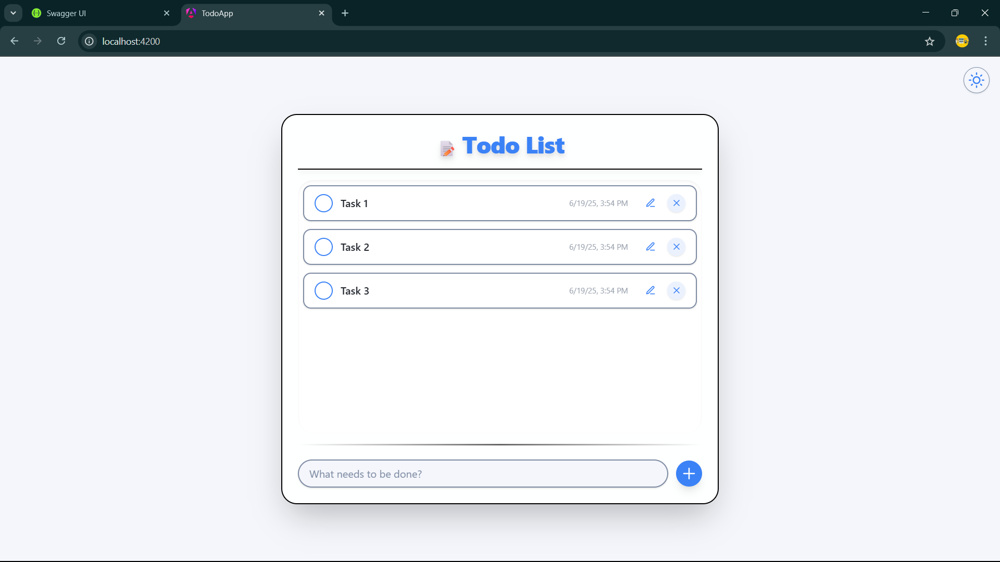
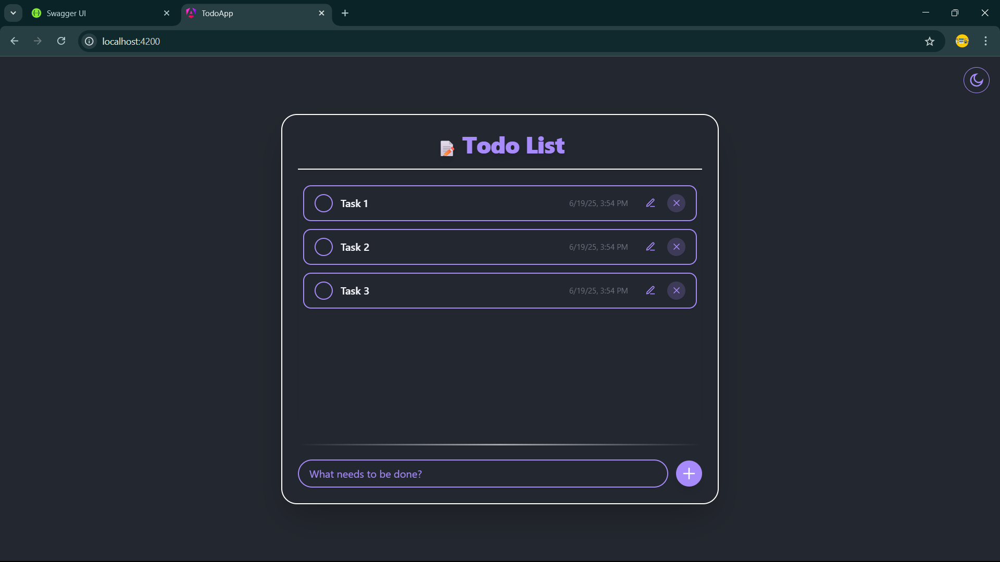

# CRUDTodoApp

Ứng dụng Todo CRUD đơn giản
## 🚀 Tech Stack

**Frontend:** Angular 20, TailwindCSS, TypeScript  
**Backend:** ASP.NET Core 9.0, Entity Framework Core, Swagger  
**Database:** SQL Server  




## 📋 Yêu cầu hệ thống

- [.NET 9.0 SDK](https://dotnet.microsoft.com/download/dotnet/9.0)
- [Node.js 18+ và npm](https://nodejs.org/)
- [SQL Server](https://www.microsoft.com/en-us/sql-server/sql-server-downloads)
- [Angular CLI](https://angular.io/cli): `npm install -g @angular/cli`

## 🔧 Hướng dẫn cài đặt

### 1. Clone Repository
```bash
git clone https://github.com/vuongsongtoan/crud-todo-app.git
cd crud-todo-app
```

### 2. Cài đặt Backend
```bash
cd server
dotnet restore
dotnet ef database update
dotnet run
```
Backend sẽ chạy tại: http://localhost:5014

### 3. Cài đặt Frontend
```bash
cd client
npm install
ng serve
```
Frontend sẽ chạy tại: http://localhost:4200

## 📚 API Documentation

Truy cập Swagger UI: http://localhost:5014/swagger


### Build cho Production
```bash
# Backend
cd server
dotnet publish -c Release

# Frontend
cd client
ng build --configuration=production
```


